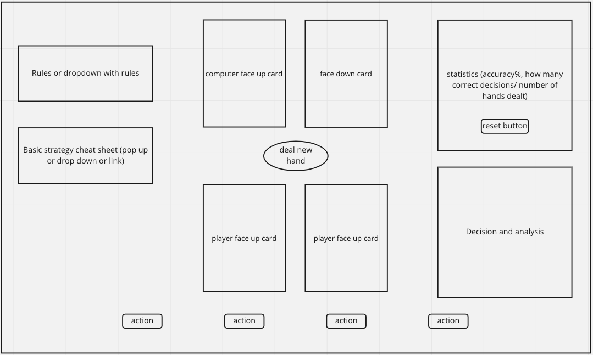

# Blackjack Trainer

## Elevator Pitch
Blackjack is one of the most popular casino games in the world. The objective of Blackjack is to have the count of the player's dealt cards to be higher than the dealers, up to but not exceeding the value of 21. The attraction to this game stems from not only the simplicity of the ruleset, but also the comparatively minimal statistical "house advantage" the casino holds. 

In a standard game of Blackjack, a typical hand would give the player ~42.22% chance of winning, ~8.48% chance of pushing(effectively a tie), and ~49.10% chance of losing the hand. However, the chances of the player losing increases drastically if they deviate from what people term "basic strategy". Basic strategy is a guide that shows the statistically optimal player move to make, taking into account the player's hand as well as the dealer's face up card. 

This Blackjack trainer simulates blackjack hands and allows players to pick a player action (hit, stand, double, split). This trainer compares the player's decision to the "statistically correct decision" and indicates whether or not the player deviated from basic strategy.

## Tech stack
HTML/CSS(vanilla, flexbox, grid)
JavaScript

## Wireframe

## MVP
1. Create table environment
2. Add ruleset
3. Randomly generate hand on deal button click
4. Cards images represent their correct value
5. Buttons to simulate player action
6. Correctly analyze hand and provide decision feedback

## Stretch Goals
1. Drop downs for rules and cheatsheet
2. Statistics tracker with a reset button
3. Audio when cards dealt
4. Super stretch: make another gamemode (actual blackjack)

## Potential Roadblocks
1. Storing and accessing the basic strategy rules for comparison(maybe objects nested in objects)
2. Displaying correct image for each card value
3. Tons of roadblocks that I don't even know of yet...

## Research Sources
CSS styling to make a card appear on screen: https://www.youtube.com/watch?v=NxRwIZWjLtE
Modals: https://www.youtube.com/watch?v=XH5OW46yO8I

## Link to Journal/Planning Document
https://hackmd.io/@paulyjkim1/p1journal